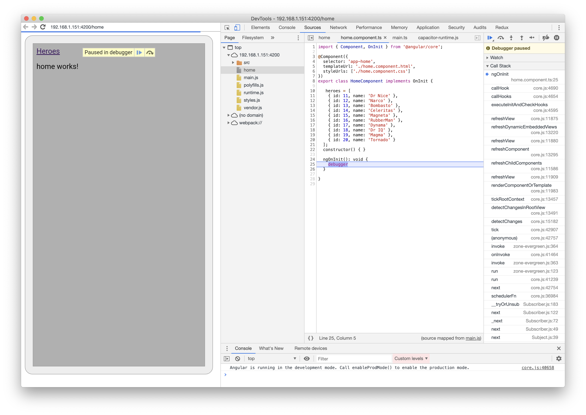
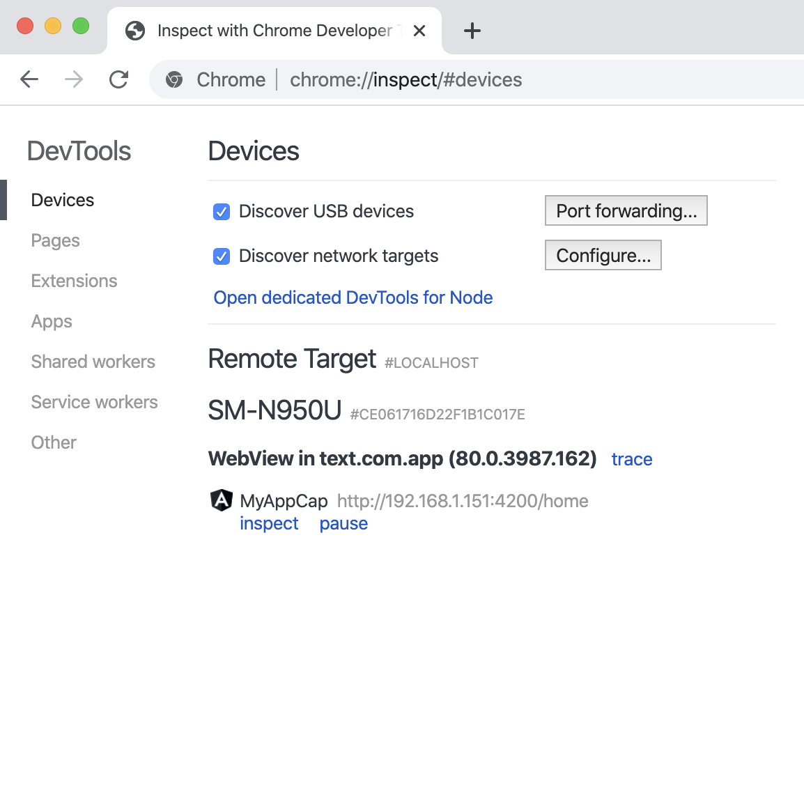

# MyAppCap

## This is a sample application about how to potentially connect a basic angular application to to work with [Ionic Capacitor](https://capacitor.ionicframework.com/)

> Please default to the great documentation from Ionic https://capacitor.ionicframework.com/docs/basics/workflow

## Files I manually Added

```json
// ionic.config.json
{
    "name": "my-app-cap",
    "integrations": {
      "capacitor": {}
    },
    "type": "angular"
  }
```  

## SET ANDROID MANIFEST
```html
<application
    android:allowBackup="true"
    android:icon="@mipmap/ic_launcher"
    android:label="@string/app_name"
    android:roundIcon="@mipmap/ic_launcher_round"
    android:supportsRtl="true"
    android:usesCleartextTraffic="true" // <== NEW
    android:theme="@style/AppTheme">
```        

## Running the App To Debug On Device
To run with live reload and debug **replace with your ip**
> If you see an error it os because in is look for a project in the `dist` directory even though you are not using it. I hacked it buy creating the path and just adding a blank `index.html` file
```
ng serve --host=192.168.1.151 --port=4200
```

Open another terminal, to copy assets to platform specific directory
```c
npx cap add android // for Android
```
Open another terminal, to copy assets to platform specific directory
```c
npx cap copy  android // for Android
```
Open Android Studio and run the app...
```
npx cap open
```
you should see in something indicating that it is runnin from your local server and NOT off the device
```
Loading app at http://192.168.1.151:4200...
```
It is loading from the server address in the `capacitor.config.json`

```json
  "server" : {
    "hostname": "app",
    "iosScheme": "ionic",
    "androidScheme": "http",
    "url" : "http://192.168.1.151:4200"
  }
```
I have quickly hacked this together so please feel free to provide feedback and open issues in the repo.
<p>

</p>
<p>

</p>
